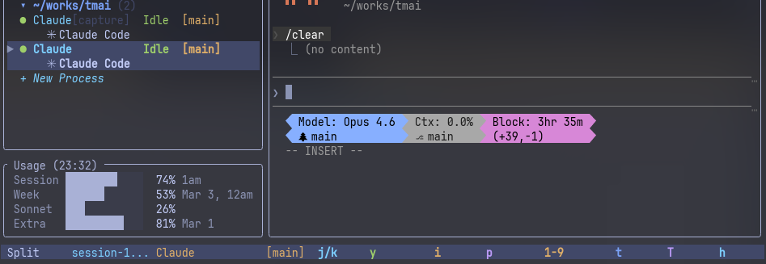

# tmai

**Tactful Multi Agent Interface** — 複数の AI コーディングエージェント (Claude Code、Codex CLI、OpenCode、Gemini CLI) を統合エンジンと差し替え可能な UI でオーケストレーションする。


> **English version**: [README.md](./README.md)

<p align="center">
  
</p>

> **このリポジトリは project hub です。** 実装は下記の sub-repo に分離されています。目的の repo を選んでください。

## リポジトリ構成

| Repo | 可視性 | 役割 |
|------|--------|------|
| [`tmai-core`](https://github.com/trust-delta/tmai-core) | private | コアエンジン — オーケストレーション、エージェント検出、ポリシー、MCP ホスト、HTTP/SSE サーバー |
| [`tmai-api-spec`](https://github.com/trust-delta/tmai-api-spec) | public | OpenAPI 3.1 + JSON Schema。core と任意の UI クライアント間のワイヤー契約 |
| [`tmai-react`](https://github.com/trust-delta/tmai-react) | public | リファレンス React WebUI。fork 可、契約を話す任意のクライアントで置換可能 |
| [`tmai-ratatui`](https://github.com/trust-delta/tmai-ratatui) | public | リファレンス ratatui ターミナル UI。`tmai-react` の対等物 |

## インストール

対応プラットフォームのバイナリリリースは本 repo の [Releases ページ](https://github.com/trust-delta/tmai/releases) に添付されます (linux x86_64 / linux aarch64 / macOS aarch64 — 配布時期は [`tmai-core#17`](https://github.com/trust-delta/tmai-core/issues/17) の後継タスクで管理)。

```bash
# クイックインストール (Releases 公開後):
curl -L https://github.com/trust-delta/tmai/releases/latest/download/tmai-$(uname -s | tr A-Z a-z)-$(uname -m).tar.gz | tar xz -C ~/.local/bin
```

それまではソースビルドを利用してください — [`tmai-core` の getting-started](https://github.com/trust-delta/tmai-core/blob/main/doc/getting-started.md) 参照 (リポジトリ権限が必要)。

## クイックスタート

```bash
# 初回セットアップ: ~/.claude/settings.json に HTTP hook receiver を登録
tmai init

# 運用ダッシュボード TUI + API サーバーを起動
tmai
```

ダッシュボードはエンジンの稼働状況を表示し、`~/.config/tmai/config.toml` に登録した UI クライアントを起動します:

```toml
[[ui]]
name = "tmai-react"
path = "~/src/tmai-react"
launch = "pnpm dev"
port = 1420
default = true
```

## 機能

- **マルチエージェント監視** — Claude Code、Codex CLI、OpenCode、Gemini CLI
- **3 段構え状態検出** — HTTP Hooks (イベント駆動) → IPC/PTY wrap → tmux `capture-pane` フォールバック
- **Auto-approve エンジン** — rules / AI / hybrid / off
- **Orchestrator agent** — ロールベース dispatch と workflow-rule 合成
- **MCP サーバー** — 22+ ツールで他エージェントを stdio JSON-RPC 2.0 経由でオーケストレーション
- **ダッシュボード TUI** — エンジン健全性、アクティビティ、検出状態、UI registry、ログを `tmai` デフォルトモードで表示
- **差し替え可能な UI** — `tmai-react` (WebUI)、`tmai-ratatui` (TUI)、または [ワイヤー契約](https://github.com/trust-delta/tmai-api-spec) を話す任意のサードパーティクライアント
- **Agent Teams** — Claude Code のチーム検出とタスク進捗トラッキング
- **Git 面** — ブランチグラフ、worktree CRUD、`gh` 経由の PR/CI/issue 連携

## 契約

UI は [`tmai-api-spec`](https://github.com/trust-delta/tmai-api-spec) で規定された 3 つの標準サーフェスで統合されます:

1. **HTTP REST** — `/api/*`
2. **SSE イベントストリーム** — `/api/events`
3. **MCP** (stdio JSON-RPC 2.0) — `tmai mcp`

spec は `tmai-core` とは独立した SemVer に従います。forward-compatible: UI は未知のイベント variant と optional フィールドを許容する必要があります。

## スクリーンショット

<p align="center">
  
</p>

<p align="center">
  
  &nbsp;&nbsp;
  
</p>

## コントリビューション

変更内容に応じた sub-repo に issue / PR を提出してください:

- **サーバーロジック、オーケストレーション、MCP、HTTP/SSE 実装** → [`tmai-core`](https://github.com/trust-delta/tmai-core/issues) (collaborator 権限必要)
- **React WebUI** → [`tmai-react`](https://github.com/trust-delta/tmai-react/issues)
- **Ratatui クライアント** → [`tmai-ratatui`](https://github.com/trust-delta/tmai-ratatui/issues)
- **ワイヤー契約 (REST エンドポイント、CoreEvent variants、error taxonomy)** → [`tmai-api-spec`](https://github.com/trust-delta/tmai-api-spec/issues)

この hub に提出された issue は triage 後に適切な sub-repo へ transfer されます。

## 履歴

本リポジトリは 2026-04-18 に 4 つの sub-repo に分割された時点までの tmai 全履歴を保持しています。split 直前の最終コミットは [88bab7d](https://github.com/trust-delta/tmai/commit/88bab7d)。以降は hub / release / landing-page の保守のみです。

旧 `tmai` の crates.io リリース (`1.7.0` まで) は後方互換のために公開継続されますが、このパスでは更新されません — 新規バイナリは本 repo の [Releases](https://github.com/trust-delta/tmai/releases) から配布されます。

## ライセンス

MIT — [LICENSE](LICENSE) 参照。
