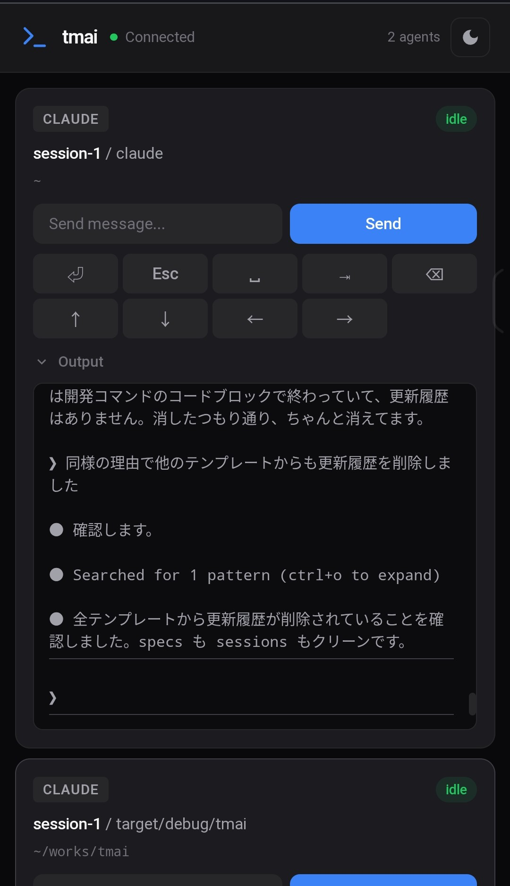
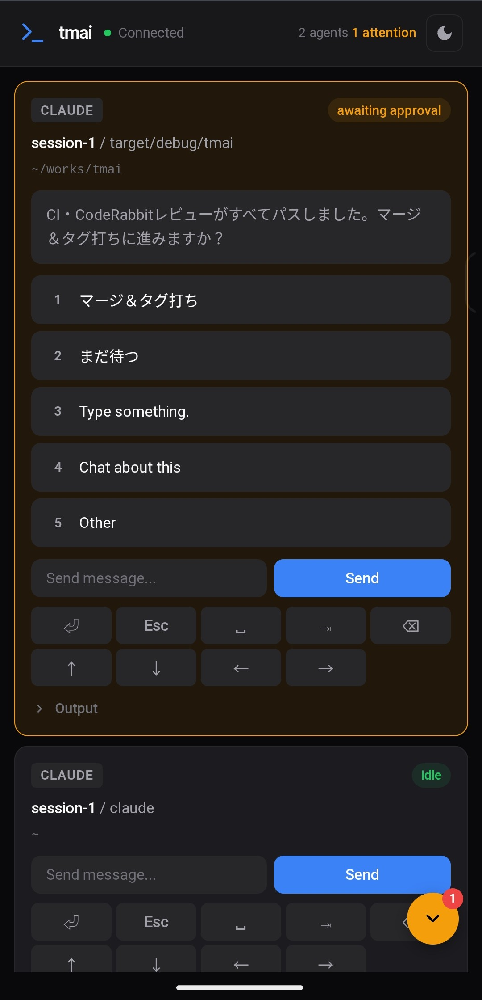

# tmai

**Tactful Multi Agent Interface** — 複数のAIコーディングエージェントを統合WebUIで監視・操作


<!-- screenshot: webui-dashboard.png -->

## 機能

### WebUIダッシュボード（デフォルト）

- **マルチエージェント監視** — Claude Code、OpenCode、Codex CLI、Gemini CLIをリアルタイムで追跡
- **インタラクティブターミナル** — WebGL描画対応のxterm.jsフルターミナル（WebSocket I/O）
- **ブランチグラフ** — GitKraken風のレーンベースコミットグラフ（ブランチ階層表示）
- **GitHub連携** — PRステータス、CIチェック、Issueとブランチの自動紐付け
- **Worktree管理** — Git worktreeの作成・削除・diff・エージェント起動
- **Markdownビューア** — プロジェクトドキュメントをアプリ内で閲覧・編集
- **セキュリティパネル** — Claude Code設定・MCP設定の脆弱性スキャン
- **使用量トラッキング** — Claude Max/Proサブスクリプションのトークン消費量を監視
- **エージェント起動** — UIから直接新規エージェントを起動（PTYまたはtmuxウィンドウ）
- **Auto-approve** — 4モードの自動承認: Rules / AI / Hybrid / Off
- **Agent Teams** — Claude Code Agent Teamsのチーム構造・タスク進捗を可視化
- **エージェント間メッセージ** — エージェント間でテキストを送信

### 3段構え状態検出

- **HTTP Hooks**（推奨）— イベント駆動、最高精度、ゼロレイテンシ
- **IPC**（PTYラップ）— Unix domain socket経由のダイレクトI/O監視
- **capture-pane**（フォールバック）— tmux画面テキスト解析、セットアップ不要

### その他のモード

- **TUIモード**（`--tmux`）— tmuxパワーユーザー向けratauiターミナルUI
- **モバイルリモート** — QRコード経由でスマホから承認操作
- **デモモード**（`demo`）— tmuxやエージェント不要で試せる

## インストール

```bash
cargo install tmai
```

ソースからビルドする場合:

```bash
git clone https://github.com/trust-delta/tmai
cd tmai
cargo build --release
```

## クイックスタート

```bash
# hooksセットアップ（初回のみ・推奨）
tmai init

# WebUIを起動（Chrome App Modeで自動オープン）
tmai
```

WebUIが `http://localhost:9876` でトークン認証付きで起動します。

### TUIモード（オプション）

tmux環境で従来のターミナルUIを使用したい場合:

```bash
# tmuxペイン内でTUIモードを起動
tmai --tmux
```

> **Note**: v0.20でデフォルトモードがWebUIに変更されました。従来のTUIは `--tmux` フラグで引き続き利用可能です。

## ドキュメント

詳しいガイド、設定リファレンス、ワークフローは [doc/](./doc/ja/README.md) を参照:

| カテゴリ | リンク |
|----------|--------|
| **はじめに** | [インストールと初期設定](./doc/ja/getting-started.md) |
| **WebUI機能** | [概要](./doc/ja/features/webui-overview.md) - [ブランチグラフ](./doc/ja/features/branch-graph.md) - [GitHub連携](./doc/ja/features/github-integration.md) - [Worktree UI](./doc/ja/features/worktree-ui.md) - [ターミナル](./doc/ja/features/terminal-panel.md) - [エージェント起動](./doc/ja/features/agent-spawn.md) |
| **その他の機能** | [Markdownビューア](./doc/ja/features/markdown-viewer.md) - [セキュリティパネル](./doc/ja/features/security-panel.md) - [使用量トラッキング](./doc/ja/features/usage-tracking.md) - [ファイルブラウザ](./doc/ja/features/file-browser.md) |
| **コア機能** | [Hooks](./doc/ja/features/hooks.md) - [Auto-Approve](./doc/ja/features/auto-approve.md) - [Agent Teams](./doc/ja/features/agent-teams.md) - [モバイルリモート](./doc/ja/features/web-remote.md) - [PTYラッピング](./doc/ja/features/pty-wrapping.md) - [Fresh Session Review](./doc/ja/features/fresh-session-review.md) - [TUIモード](./doc/ja/features/tui-mode.md) |
| **ワークフロー** | [マルチエージェント](./doc/ja/workflows/multi-agent.md) - [Worktree並列開発](./doc/ja/workflows/worktree-parallel.md) - [リモート承認](./doc/ja/workflows/remote-approval.md) |
| **リファレンス** | [設定](./doc/ja/reference/config.md) - [キーバインド](./doc/ja/reference/keybindings.md) - [Web API](./doc/ja/reference/web-api.md) |

## 対応エージェント

| エージェント | 検出 | Hooks | PTYラップ |
|--------------|------|-------|-----------|
| Claude Code | ✅ | ✅ | ✅ |
| OpenCode | ✅ | — | ✅ |
| Codex CLI | ✅ | — | ✅ |
| Gemini CLI | ✅ | — | ✅ |

## スクリーンショット

### WebUIダッシュボード

<!-- screenshot: webui-main.png -->

### ブランチグラフ

<!-- screenshot: branch-graph.png -->

### モバイルリモート

<p align="center">
  
  &nbsp;&nbsp;
  
</p>

## 謝辞

[tmuxcc](https://github.com/nyanko3141592/tmuxcc) にインスピレーションを受けました。

## コントリビューション

[CONTRIBUTING.ja.md](./CONTRIBUTING.ja.md) をご覧ください。

## ライセンス

MIT
