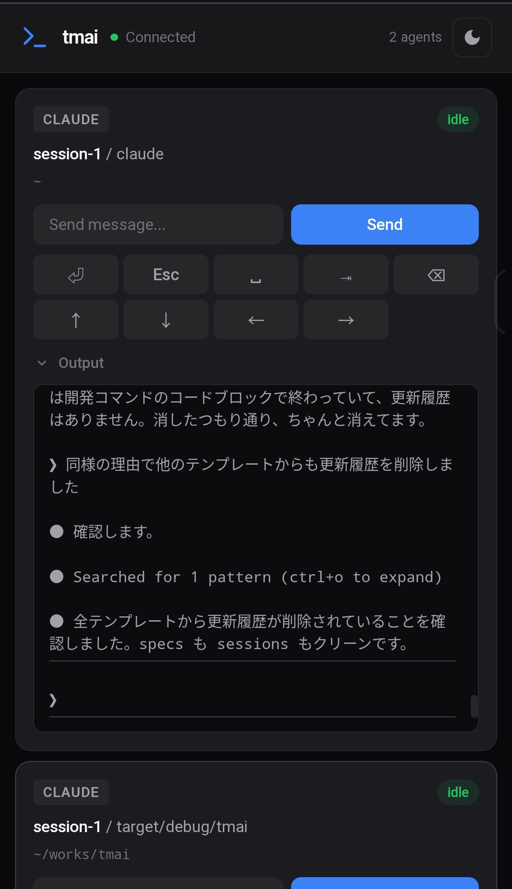
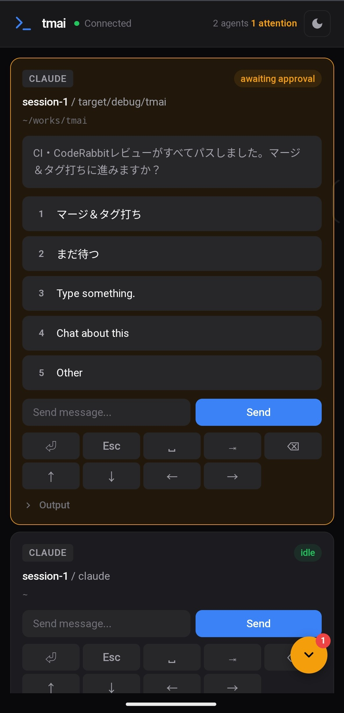
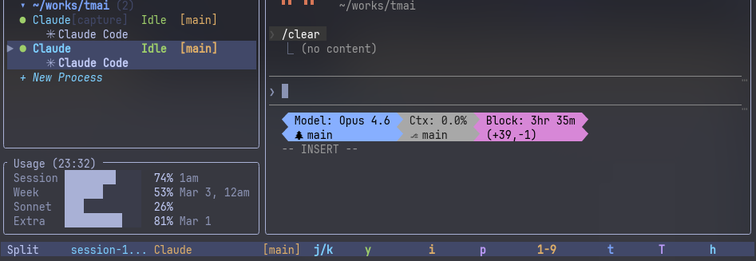

# tmai

**Tmux Multi Agent Interface** - Monitor and control multiple AI agents running in tmux.


## Features

- **Multi-agent monitoring** - Track multiple AI coding agents (Claude Code, OpenCode, etc.) across tmux panes
- **Single-pane operation** - Approve without attaching to agent panes
- **Real-time preview** - See agent output without switching panes (with ANSI color support)
- **Quick approval** - Approve tool calls with single keystroke (`y`)
- **AskUserQuestion support** - Respond to agent questions with number selection
- **Passthrough mode** - Send keys directly to the agent pane
- **Status detection** - Automatic detection of idle, processing, and awaiting approval states
- **PTY wrapping** - High-precision state detection via PTY proxy for real-time I/O monitoring
- **Exfil detection** - Security monitoring for external data transmission
- **Web Remote Control** - Control agents from your smartphone via QR code
- **Agent Teams** - Visualize Claude Code Agent Teams structure and task progress
- **Mode detection** - Detect Plan/Delegate/Auto-approve modes from terminal title icons
- **Auto-approve** - Automatic approval of safe actions with 4 modes: Rules (instant), AI, Hybrid, or Off
- **Usage monitoring** - Check Claude subscription usage (5h session / weekly limits) with `U` key

## Documentation

For detailed guides and workflows, see [doc/](./doc/README.md):

- [Getting Started](./doc/getting-started.md) - Installation and first steps
- [Multi-agent Monitoring](./doc/workflows/multi-agent.md) - Monitor multiple agents simultaneously
- [Worktree Parallel Development](./doc/workflows/worktree-parallel.md) - Git worktree workflow
- [tmai's Strengths](./doc/guides/strengths.md) - What makes tmai unique
- [Agent Teams](./doc/features/agent-teams.md) - Claude Code team monitoring
- [Auto-Approve](./doc/features/auto-approve.md) - Automatic approval with 4 modes (Rules/AI/Hybrid/Off)

## Installation

```bash
cargo install tmai
```

Or build from source:

```bash
git clone https://github.com/trust-delta/tmai
cd tmai
cargo build --release
```

## Usage

Run `tmai` in a tmux session:

```bash
tmai
```

### Configuration

Create a config file in one of these locations (first found wins):

- `~/.config/tmai/config.toml`
- `~/.tmai.toml`

Example:

```toml
poll_interval_ms = 500
passthrough_poll_interval_ms = 10
capture_lines = 100
attached_only = true

[ui]
show_preview = true
preview_height = 40
color = true

[teams]
enabled = true
scan_interval = 5

[auto_approve]
enabled = true
model = "haiku"
```

### Keybindings

| Key | Action |
|-----|--------|
| `j` / `k` | Navigate agents |
| `y` | Approve / select Yes |
| `n` | Select No (UserQuestion) |
| `1-9` | Select option by number |
| `Space` | Toggle (multi-select) |
| `i` | Enter input mode |
| `→` | Enter passthrough mode |
| `t` | Task overlay (team member selected) |
| `T` | Team overview |
| `W` | Restart as IPC-wrapped (non-IPC Claude Code) |
| `U` | Fetch subscription usage (Claude Max/Pro) |
| `Esc` | Exit mode / Quit |
| `?` | Help |

### Modes

- **Normal mode** - Navigate and quick actions
- **Input mode** (`i`) - Type text to send to agent
- **Passthrough mode** (`→`) - Keys sent directly to pane

## PTY Wrapping

For more accurate state detection, you can wrap AI agents with a PTY proxy:

```bash
# Start Claude Code with PTY wrapping
tmai wrap claude

# With arguments
tmai wrap claude --dangerously-skip-permissions

# Other agents
tmai wrap codex
tmai wrap gemini
```

Benefits:
- **Real-time I/O monitoring** - Detects state changes immediately
- **No polling delay** - Faster than tmux capture-pane
- **Accurate approval detection** - Reliable Yes/No and AskUserQuestion detection

When creating new AI processes from tmai UI, they are automatically wrapped.

## Web Remote Control

Control your AI agents from your smartphone:

1. Press `r` to display QR code
2. Scan with your phone
3. Approve or select options from the web interface

<p align="center">
  
  &nbsp;&nbsp;
  
</p>

```toml
# config.toml
[web]
enabled = true
port = 9876
```

### WSL2 Setup

For WSL2 with mirrored networking mode, allow the port through Windows Firewall:

```powershell
# Run as Administrator
New-NetFirewallRule -DisplayName "tmai Web Remote" -Direction Inbound -Protocol TCP -LocalPort 9876 -Action Allow
```

For NAT mode (legacy), see [CLAUDE.md](./CLAUDE.md#wsl環境での利用) for port forwarding setup.

## Supported Agents

| Agent | Detection | PTY Wrap |
|-------|-----------|----------|
| Claude Code | ✅ Supported | ✅ |
| OpenCode | ✅ Supported | ✅ |
| Codex CLI | ✅ Supported | ✅ |
| Gemini CLI | ✅ Supported | ✅ |

## Usage Monitoring

Press `U` to check your Claude subscription usage (session / weekly limits). tmai spawns a temporary Claude Code instance in the background, runs `/usage`, and displays the results.

<p align="center">
  
</p>

## Screenshots

```
┌─────────────────┬─────────────────────────────────┐
│ Sessions        │ Preview                         │
│                 │                                 │
│ [IPC] main:0.0  │ Do you want to make this edit?  │
│   Claude Code   │                                 │
│   ⠋ Processing  │ ❯ 1. Yes                        │
│                 │   2. Yes, allow all...          │
│ [capture] 0.1   │   3. No                         │
│   Claude Code   │                                 │
│   ✳ Idle        │                                 │
└─────────────────┴─────────────────────────────────┘
 j/k:Nav 1-9:Select i:Input →:Direct ?:Help q:Quit
```

## Acknowledgments

Inspired by [tmuxcc](https://github.com/nyanko3141592/tmuxcc).

## License

MIT
