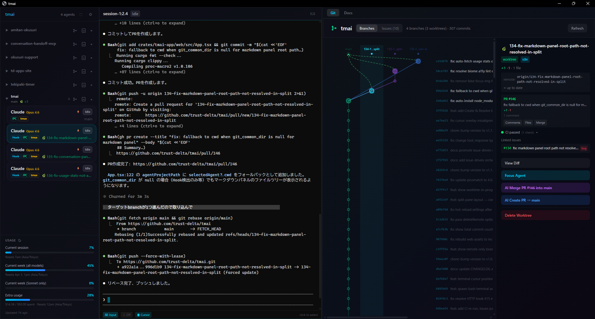

# tmai

**Tactful Multi Agent Interface** — Monitor and control multiple AI coding agents from a unified WebUI.




## Features

### WebUI Dashboard (Default)

- **Multi-agent monitoring** — Track Claude Code, OpenCode, Codex CLI, Gemini CLI in real-time
- **Interactive terminal** — Full xterm.js terminal with WebGL rendering and WebSocket I/O
- **Branch graph** — GitKraken-style lane-based commit graph with branch hierarchy
- **GitHub integration** — PR status, CI checks, issues with branch-to-issue linking
- **Worktree management** — Create, delete, diff, and launch agents in Git worktrees
- **Markdown viewer** — Browse and edit project documentation in-app
- **Security panel** — Scan Claude Code settings and MCP configs for vulnerabilities
- **Usage tracking** — Monitor token consumption for Claude Max/Pro subscriptions
- **Agent spawn** — Launch new agents directly from the UI (PTY or tmux window)
- **Auto-approve** — Automatic approval with 4 modes: Rules / AI / Hybrid / Off
- **MCP server** — Expose tmai as an MCP server for AI agents to orchestrate other agents
- **Agent Teams** — Visualize Claude Code Agent Teams and task progress
- **Inter-agent messaging** — Send text between agents
- **Cursor tracking** — Terminal cursor overlay in preview (tmux + IPC/VT100, CJK-aware)

### 3-Tier State Detection

- **HTTP Hooks** (recommended) — Event-driven, highest precision, zero latency
- **IPC** (PTY wrap) — Direct I/O monitoring via Unix domain socket
- **capture-pane** (fallback) — tmux screen text analysis, no setup required

### Additional Modes

- **TUI mode** (`--tmux`) — ratatui terminal UI for tmux power users
- **Mobile remote** — Approve from your smartphone via QR code
- **Demo mode** (`demo`) — Try without tmux or agents

## Installation

```bash
cargo install tmai
```

## Quick Start

```bash
# Set up hooks for high-precision detection (one-time)
tmai init

# Launch WebUI (opens Chrome App Mode automatically)
tmai
```

The WebUI opens at `http://localhost:9876` with token-based authentication.

### TUI Mode (Optional)

```bash
# Run in tmux TUI mode (requires tmux)
tmai --tmux
```

## Documentation

Detailed guides, configuration reference, and workflows are available in [doc/](./doc/README.md).

| Category | Links |
|----------|-------|
| **Getting Started** | [Installation & First Steps](./doc/getting-started.md) |
| **WebUI Features** | [Overview](./doc/features/webui-overview.md) - [Branch Graph](./doc/features/branch-graph.md) - [GitHub Integration](./doc/features/github-integration.md) - [Worktree UI](./doc/features/worktree-ui.md) - [Terminal](./doc/features/terminal-panel.md) - [Agent Spawn](./doc/features/agent-spawn.md) |
| **More Features** | [Markdown Viewer](./doc/features/markdown-viewer.md) - [Security Panel](./doc/features/security-panel.md) - [Usage Tracking](./doc/features/usage-tracking.md) - [File Browser](./doc/features/file-browser.md) |
| **Core Features** | [Hooks](./doc/features/hooks.md) - [MCP Server](./doc/features/mcp-server.md) - [Auto-Approve](./doc/features/auto-approve.md) - [Agent Teams](./doc/features/agent-teams.md) - [Mobile Remote](./doc/features/web-remote.md) - [PTY Wrapping](./doc/features/pty-wrapping.md) - [Fresh Session Review](./doc/features/fresh-session-review.md) - [TUI Mode](./doc/features/tui-mode.md) |
| **Workflows** | [Multi-agent](./doc/workflows/multi-agent.md) - [Worktree Parallel](./doc/workflows/worktree-parallel.md) - [Remote Approval](./doc/workflows/remote-approval.md) |
| **Reference** | [Config](./doc/reference/config.md) - [Keybindings](./doc/reference/keybindings.md) - [Web API](./doc/reference/web-api.md) |

## Supported Agents

| Agent | Detection | Extra | PTY Wrap |
|-------|-----------|-------|----------|
| Claude Code | Yes | HTTP Hooks | Yes |
| Codex CLI | Yes | WebSocket (app-server) | Yes |
| OpenCode | Yes | — | Yes |
| Gemini CLI | Yes | — | Yes |

## Screenshots

### WebUI Dashboard

<!-- screenshot: webui-main.png -->

### Branch Graph

<!-- screenshot: branch-graph.png -->

### Mobile Remote

<p align="center">
  
  &nbsp;&nbsp;
  
</p>

## Contributing

See [CONTRIBUTING.md](./CONTRIBUTING.md) for guidelines.

## License

MIT
